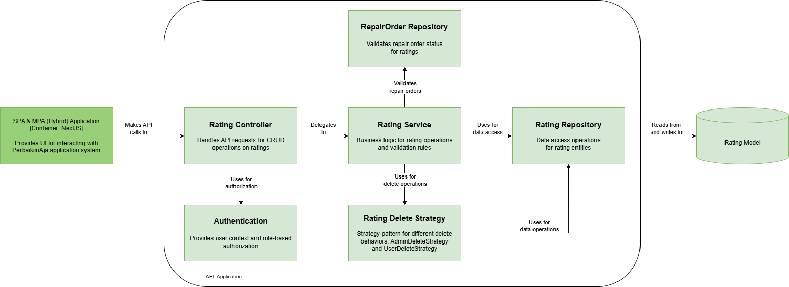
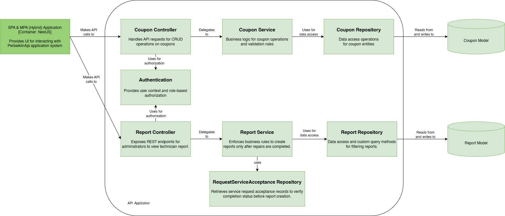
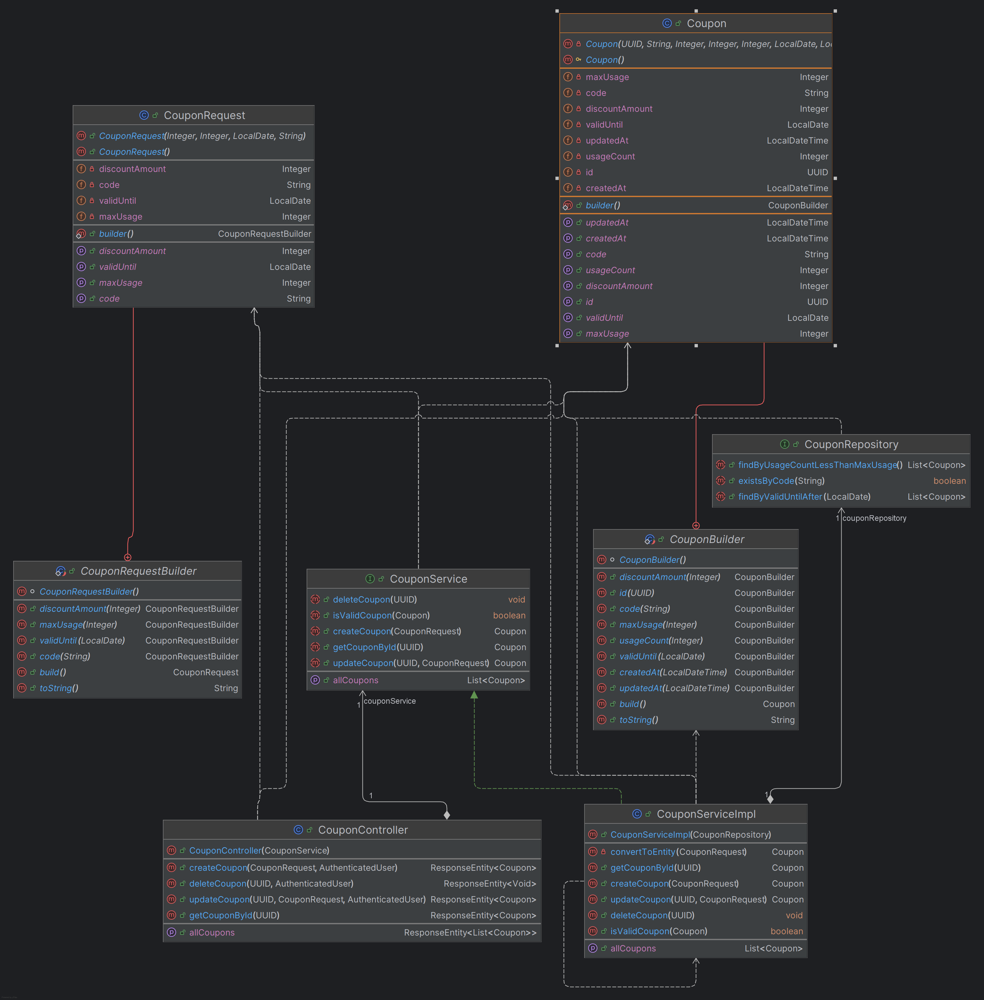

# PerbaikiinAja Main Resource Backend - Everest

## Table of Contents
- [About the Project](#about-the-project)
- [Team Members](#team-members)
- [System Architecture](#system-architecture)
  - [Shared Diagrams](#shared-diagrams)
    - [Context Diagram](#context-diagram)
    - [Container Diagram](#container-diagram)
    - [Deployment Diagram](#deployment-diagram)
  - [Feature-Specific Diagrams](#feature-specific-diagrams)
    - [Request Repair Orders](#request-repair-orders)
    - [Accept and Confirm Repair Orders](#accept-and-confirm-repair-orders)
    - [Manage Reviews and Ratings](#manage-reviews-and-ratings)
    - [View Reports and Manage Coupons](#view-reports-and-manage-coupons)
    - [Manage Payment Methods](#manage-payment-methods)
- [Future Architecture](#future-architecture)
- [Risk Analysis and Architecture Modification Justification](#risk-analysis-and-architecture-modification-justification)

## About the Project
PerbaikiinAja is a repair service management system with a backend codenamed "Everest". This platform facilitates repair orders, service provider management, customer reviews, and payment processing.

## Team Members
**Kelompok A07**
- Arditheus Immanuel Hanfree (2206083451) - *Manage Payment Methods*
- Yudayana Arif Prasojo (2306215160) - *Request Repair Orders*
- Khansa Khairunisa (2306152462) - *Manage Reviews and Ratings*
- Danniel (2306152090) - *Accept and Confirm Repair Orders*
- Muhammad Farid Hasabi (2306152512) - *View Reports and Manage Coupons*

## System Architecture

### Shared Diagrams

#### Context Diagram

#### Container Diagram

#### Deployment Diagram

### Feature-Specific Diagrams

#### Request Repair Orders
*Developed by: Yudayana Arif Prasojo*
- Component Diagram
  

- Code Diagram
  

#### Accept and Confirm Repair Orders
*Developed by: Danniel*
- Component Diagram
- Code Diagram

#### Manage Reviews and Ratings
*Developed by: Khansa Khairunisa*
- Component Diagram
  
- Code Diagram
  

#### View Reports and Manage Coupons
*Developed by: Muhammad Farid Hasabi*
- Component Diagram 
  

- Code Diagram
  - Coupon
    
  - Report  
    

#### Manage Payment Methods
*Developed by: Arditheus Immanuel Hanfree*
- Component Diagram
- Code Diagram

## Future Architecture

### Future Architecture

Untuk mempersiapkan sistem yang lebih modular dan maintainable, arsitektur aplikasi PerbaikiinAja dirancang ulang dengan pendekatan container-based. Perubahan utama yang dilakukan antara lain:

- **API Gateway:** Ditambahkan sebagai pintu masuk utama untuk semua request dari client, memudahkan routing dan security management
- **Containerization:** Frontend, Auth Service, dan Main Resource Service dijalankan dalam Docker container terpisah yang dikelola oleh Docker Compose
- **RabbitMQ:** Dipersiapkan untuk menangani komunikasi asynchronous untuk fitur notifikasi di masa depan
- **Persistent Storage:** Volume terpisah untuk data persistensi setiap service

### Keuntungan dari Arsitektur Ini:

- **Modularitas Sederhana:** Pemisahan layanan dalam container memudahkan pengelolaan tanpa berlebihan kompleks
- **Kemudahan Deployment:** Docker Compose memungkinkan deployment yang konsisten dan mudah direplikasi
- **Fleksibilitas Scaling:** Setiap container dapat di-scale secara independen sesuai kebutuhan
- **Persiapan untuk Fitur Baru:** RabbitMQ siap digunakan ketika fitur notifikasi diimplementasikan
- **Isolasi yang Jelas:** Setiap layanan memiliki batas dan tanggung jawab yang jelas

## Risk Analysis and Architecture Modification Justification

### Identifikasi Risiko

1. **Monolithic Load pada VPS Deployment**
  - **Risiko:** Seluruh komponen saat ini dijalankan dalam satu VPS menggunakan Coolify
  - **Dampak:** Jika salah satu service mengalami beban berat, performa keseluruhan sistem menurun

2. **Kurangnya Isolasi antar Layanan**
  - **Risiko:** Auth service dan main service saling bergantung langsung tanpa mekanisme gateway
  - **Dampak:** Kegagalan pada satu service dapat mengganggu seluruh sistem

3. **Keterbatasan dalam Komunikasi Asinkron**
  - **Risiko:** Tidak ada mekanisme untuk komunikasi asinkron antar layanan
  - **Dampak:** Fitur notifikasi dan pemrosesan latar belakang sulit diimplementasikan

### Tabel Risiko

| **Risiko** | **Dampak** | **Kemungkinan** | **Penilaian (1-10)** |
|------------|------------|-----------------|----------------------|
| Beban VPS saat trafik meningkat | Tinggi | Sedang | 8 |
| Gangguan antar service backend | Sedang | Sedang | 6 |
| Keterbatasan komunikasi asinkron | Sedang | Rendah | 4 |

### Mitigasi Risiko

- **Container Isolation:** Memisahkan layanan ke dalam container yang berbeda memungkinkan pengelolaan resource yang lebih baik dan isolasi kegagalan
- **API Gateway Implementation:** Traefik sebagai API gateway akan mengelola routing, load balancing sederhana, dan fallback response
- **Message Queue Preparation:** RabbitMQ dipersiapkan untuk menangani komunikasi asinkron ketika fitur notifikasi dikembangkan

### Justifikasi Perubahan Arsitektur

Modifikasi arsitektur yang diusulkan dirancang dengan prinsip **"mulai sederhana, persiapkan untuk berkembang"**:

1. **Containerization via Docker:** Pendekatan ini memberikan isolasi dan portabilitas tanpa overhead kompleksitas Kubernetes
2. **Traefik sebagai API Gateway:** Solusi ringan yang menyediakan routing dan load balancing dasar
3. **RabbitMQ sebagai Message Broker:** Dipersiapkan untuk kebutuhan masa depan tanpa overengineering sejak awal

Perubahan ini berfokus pada mengatasi risiko yang telah diidentifikasi sambil mempertahankan kompleksitas yang dapat dikelola oleh tim. Dengan arsitektur ini, sistem mendapatkan keuntungan dari isolasi dan modularitas, namun tetap mudah dipahami dan dipelihara oleh tim pengembangan.

### Justifikasi Penggunaan Teknik Risk Storming

Risk Storming adalah teknik yang kami terapkan karena memungkinkan tim untuk mengidentifikasi risiko arsitektur dari berbagai sudut pandang. Pada skenario PerbaikiinAja yang sedang berkembang pesat, kami menggunakan Risk Storming dengan langkah-langkah berikut: (1) mengidentifikasi komponen utama sistem, (2) menilai risiko pada setiap komponen dengan skala 1-10, (3) memvisualisasikan "hotspot" risiko pada diagram arsitektur, dan (4) memprioritaskan mitigasi berdasarkan nilai risiko tertinggi.

Dengan pendekatan ini, kami menemukan bahwa beban VPS (nilai risiko 8) merupakan ancaman terbesar jika aplikasi mendapatkan popularitas tinggi. Teknik Risk Storming membantu tim kami tidak hanya fokus pada fungsionalitas, tetapi juga mempertimbangkan ketahanan sistem secara keseluruhan pada berbagai skenario pertumbuhan. Hasil dari proses ini adalah arsitektur yang tidak hanya antisipatif terhadap risiko, tetapi juga tetap dalam batas kompleksitas yang dapat dikelola tim saat ini.